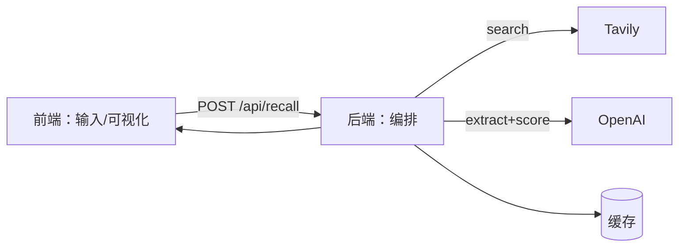

# 技术设计: Glimpse 游戏找回 Demo（Next.js + Tavily + 可视化事件流）

## 技术方案

### 核心技术
- Next.js（前端 + API 一体化）
- Tavily Search API（全网搜索）
- OpenAI（把搜索结果整理成：候选游戏、证据、打分理由）

### 实现要点（按大白话流程）
1. **把用户输入变成“线索”**：用户一句话 + 可编辑的线索 chips
2. **多轮搜索**：让系统用不同的关键词组合去搜（减少漏网）
3. **提炼候选**：从搜索结果里提取可能的“游戏名”，并记录每个候选的证据（链接+摘要）
4. **合并去重**：同名/别名/大小写不同的合并成一个候选
5. **量化打分**：每条线索对每个候选“加多少/减多少”，得出 0~100 总分
6. **生成事件流**：把上面的过程切成前端可播放的关键帧
7. **前端动画**：按事件流播放“筛选关卡”，最后用扭蛋机展示 Top

---

## 架构设计



---

## 架构决策 ADR

### ADR-001: 采用 Next.js 一体化（前端+API）
**上下文:** Demo 阶段要快、要好改、要好对接 aistudio 产出的原型；同时要保护 `API key`。
**决策:** 采用 Next.js 一体化项目：前端页面 + `/api` 接口同仓库同进程运行。
**理由:** 跑起来最省事；对接时只要统一数据结构；key 放在后端更安全。
**替代方案:** 前后端分离 → 拒绝原因: Demo 成本更高（跨域/两套启动/同步数据结构）。
**影响:** 后续要“拆后端”也可以把 `/api` 抽出去，不会卡死。

### ADR-002: 搜索 与 提炼/解释 分工
**上下文:** 纯搜索结果太杂；纯大模型又容易“拍脑袋”。我们既要全网覆盖，也要证据链。
**决策:** Tavily 负责“搜到网页与摘要”；OpenAI 负责“从摘要里提炼候选、做打分解释”；最终结果必须带来源链接。
**理由:** 可控、可解释；把“证据”作为硬约束降低胡说风险。
**替代方案:** 只用大模型直接回答 → 拒绝原因: 难以量化过程，且证据链不足。
**影响:** 需要做缓存/限流，避免成本和延迟失控。

---

## API设计

### [POST] /api/recall

**请求（建议形状）:**
```json
{
  "query": "用户的一句话描述",
  "clues": [
    { "text": "像素风", "polarity": "positive", "weight": 3 }
  ],
  "options": { "topK": 5, "stages": 3 }
}
```

**响应（建议形状）:**
```json
{
  "runId": "唯一ID",
  "events": [
    { "phase": "search", "message": "搜到了多少结果", "payload": {} },
    { "phase": "extract", "message": "提炼出了哪些候选", "payload": {} },
    { "phase": "filter", "message": "第1关筛选", "payload": {} },
    { "phase": "score", "message": "分数变化", "payload": {} },
    { "phase": "gacha", "message": "最终掉落", "payload": {} }
  ],
  "candidates": [
    {
      "name": "游戏名",
      "score": 92,
      "scoreBreakdown": [{ "clue": "像素风", "delta": 8, "reason": "证据..." }],
      "evidence": [{ "url": "https://...", "snippet": "..." }]
    }
  ]
}
```

---

## 安全与性能

- **安全:**
  - `TAVILY_API_KEY` / `OPENAI_API_KEY` 只放在后端环境变量（`.env.local`），前端永远不接触
  - 返回结果里只给“证据链接”，不去抓取需要登录/付费的内容
- **性能/成本:**
  - 加缓存（同样输入短时间重复请求不重复调用外部 API）
  - 设置超时/重试（外部服务慢时要能降级）
  - 默认限制每次运行的“搜索轮数”和“候选数量”，避免一口气炸掉

---

## 测试与部署

- **测试（Demo 最小版）:**
  - 关键函数做单测：去重、打分汇总、事件流生成
  - API 做一个简单集成测试：输入固定请求（用 mock 替代外部调用）看输出结构是否稳定
- **部署:**
  - 先支持本地运行 Demo（后续再考虑上云）

