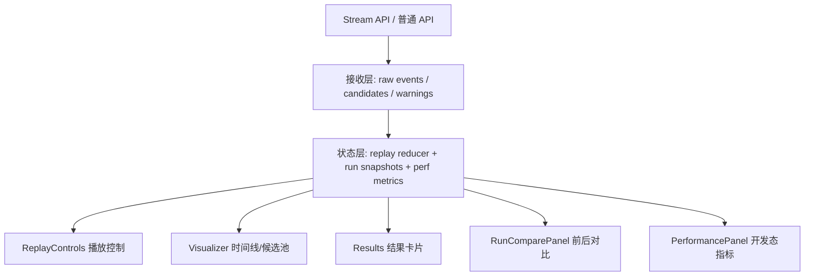

# 技术设计: 把 Glimpse 升级成更像前端项目的展示型 Demo

## 技术方案

### 核心技术
- React + Next.js App Router
- TypeScript 类型约束
- Tailwind CSS + 少量自定义动效样式
- 现有 `/api/recall` 与 `/api/recall/stream` 接口
- Vitest（前端状态与派生逻辑测试）

### 实现要点
- 把“流式接收”和“播放展示”拆成两层状态：前者负责接消息，后者负责决定当前应该展示到哪一步
- 增加 `ReplayControls`、`RunComparePanel`、`PerformancePanel` 等前端组件，让复杂交互从 `GlimpseApp.tsx` 拆出去
- 用快照和派生选择器计算“当前播放帧”的候选池、时间线高亮和结果区内容，避免每次都从头重复计算
- 对时间线和候选池做渲染优化，减少流式阶段的无意义全量重渲染
- 引入前端本地对比数据结构，记录最近几次运行的输入、输出和关键指标，为“对比视图”和“简历量化”提供基础

## 架构设计



## 架构决策 ADR

### ADR-004: 分离“流式接收状态”和“播放展示状态”
**上下文:** 现在 `GlimpseApp.tsx` 同时承担请求发起、流式解码、事件追加、候选池更新、结果揭晓和主题控制，继续往里堆播放器逻辑会很快失控。

**决策:** 新增前端状态层，把“接收到什么数据”和“当前播放到哪一步”拆开：
- 接收层保留原始事件、候选、警告和运行元数据
- 播放层维护当前游标、播放速度、是否自动播放、当前展示快照

**理由:** 这样后面做暂停、拖动、回看、比较时，不用反复修改请求逻辑；复杂交互会更容易测，也更像一个成熟前端系统。

**替代方案:** 继续在 `GlimpseApp.tsx` 里追加多个 `useState`
→ 拒绝原因: 状态会继续缠在一起，后面很难做性能优化和交互测试。

**影响:** 需要新增状态辅助工具与派生函数，但长期可维护性更好。

### ADR-005: 前后对比先用“本地运行快照”，不新开后端 diff 接口
**上下文:** “比较两次检索差异”是很强的前端亮点，但如果第一版就做服务端 diff，会把需求扩大成新的接口设计与缓存策略。

**决策:** 先在前端保存最近几次运行快照（输入、事件摘要、Top 结果、关键指标），对比逻辑全部在浏览器本地完成。

**理由:** 这样能最快做出前端可见价值，而且实现成本可控；等后面真有跨端同步需求，再考虑服务端对比接口。

**替代方案:** 新增 `/api/recall/diff` 之类的接口
→ 拒绝原因: 现在收益不够大，且会把本次重点从前端展示拉回后端接口。

**影响:** 本地存储要控制大小和保留条数，避免浏览器内存压力。

## API设计

### [POST] /api/recall
- **请求:** 维持现有结构
- **响应:** 维持现有结构；由前端在本地生成运行快照和指标

### [POST] /api/recall/stream
- **请求:** 维持现有结构
- **响应:** 维持现有 `event / candidates / warning / done / error` 消息类型

> 结论：第一版不强制新增后端接口，优先做前端能力升级。

## 数据模型

```ts
type ReplayPlayback = {
  cursor: number;
  isPlaying: boolean;
  speed: 0.5 | 1 | 2;
  mode: "auto" | "manual";
};

type RunSnapshot = {
  runId: string;
  query: string;
  clues: Array<{ text: string; polarity: "positive" | "negative" }>;
  topResults: Array<{ id: string; name: string; score: number }>;
  metrics: {
    firstEventMs: number | null;
    replayDurationMs: number | null;
    eventCount: number;
    candidateCount: number;
  };
  createdAt: number;
};
```

## 安全与性能
- **安全:**
  - 不新增前端可见密钥
  - 本地快照只保存输入、候选摘要和前端指标，不保存任何敏感令牌
- **性能:**
  - 对流式更新做分层处理，避免每条消息都触发整页重算
  - 时间线和候选池优先做派生缓存与 `React.memo` 级别优化
  - 超长时间线可补充窗口化/分段渲染，避免 DOM 节点持续膨胀
  - 对动画增加 `prefers-reduced-motion` 降级分支，避免强动画拖慢体验

## 测试与部署
- **测试:**
  - 为播放状态 reducer、游标计算、运行快照对比逻辑增加 Vitest 用例
  - 为关键派生函数补充“暂停/跳步/倍速/对比结果变化”测试
  - 手动验证键盘操作、减少动效模式、流式回退链路
- **部署:**
  - 不涉及数据库和服务端迁移
  - 如增加开发态性能面板，默认只在实验/开发模式下展示
