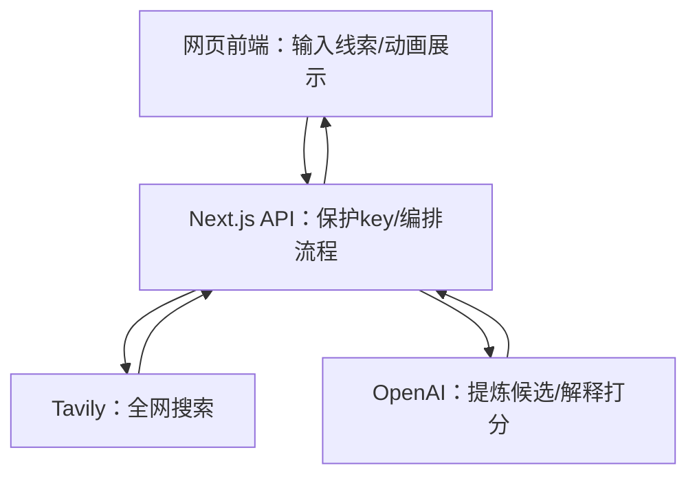
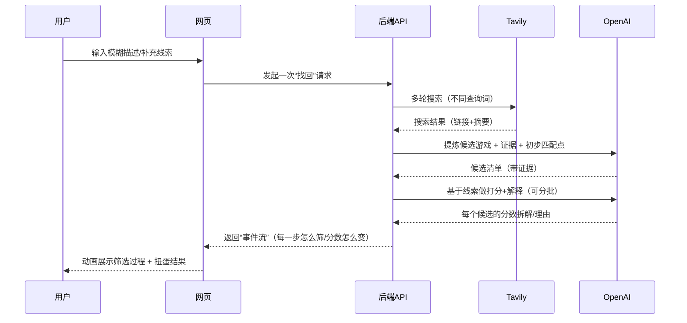

# 架构设计

## 总体架构

---

## 技术栈（计划）

- **一体化框架:** Next.js + TypeScript
- **搜索:** Tavily Search API
- **推理/提炼:** OpenAI（把网页摘要变成“候选游戏 + 证据 + 可读理由”）
- **可视化:** Tailwind + 前端动画（“关卡筛选” + “扭蛋掉落”）
- **图标:** Font Awesome（当前用 CDN，引入成本低，后续可替换）

---

## 核心流程（用户视角）

---

## 重大架构决策

| adr_id | title | date | status | affected_modules | details |
|--------|-------|------|--------|------------------|---------|
| ADR-001 | 采用 Next.js 一体化（前端+API） | 2026-02-10 | ✅已采纳 | 前端/后端 | 见 [how.md](../history/2026-02/202602100240_glimpse_game_demo/how.md#adr-001-采用-nextjs-一体化前端api) |
| ADR-002 | 搜索选 Tavily，提炼/解释用 OpenAI | 2026-02-10 | ✅已采纳 | providers/pipeline | 见 [how.md](../history/2026-02/202602100240_glimpse_game_demo/how.md#adr-002-搜索-与-提炼解释-分工) |
| ADR-003 | 为了原型一致性引入 Tailwind | 2026-02-10 | ✅已采纳 | 前端 | 见 [how.md](../history/2026-02/202602101831_frontend_prototype_integration/how.md#adr-003-为了原型一致性引入-tailwind) |
